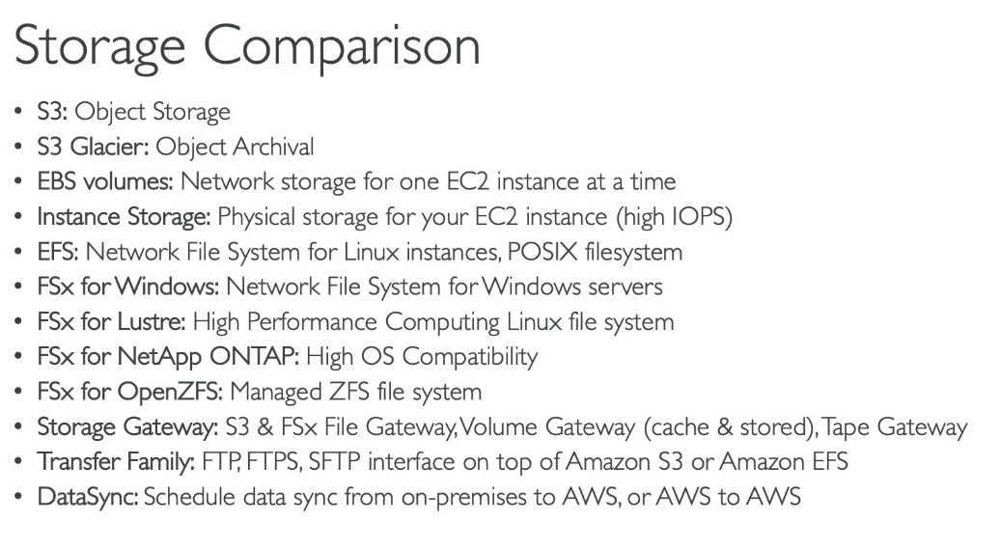
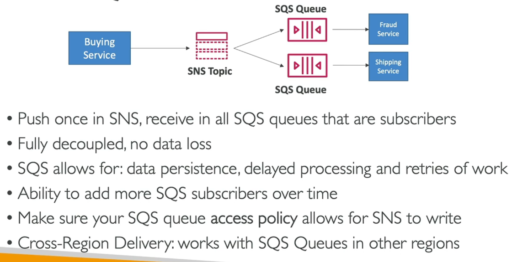
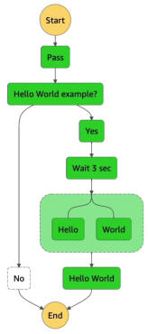

# AWS SAA Cerificate Prep

## Security

### IAM

- users
  - for actual user
- groups
  - for group of users
- roles
  - for giving permission to services
  - ex. IAM roles for EC2
- tools
  - Access Advisor
  - Credential report

## Storage Services



### EBS (Elastic Block Store)

- `one-to-one` to EC2 instance
- Bound to a specific AZ
- Free tier: `30GB` general purpose (ssd/disk) per month
- It's a `network drive` - can be (de/at)tached (to/from) an EC2 instance
- Snapshot it to move to another AZ
- Can increase capasity over time
- Snapshot
  - Archive `<75%` - `24-72 hours` to restore
  - Fast Snapshot Restore - `$$$`
  - Can have `Recycle Bin` - retension `1 day - 1 year`
- Types
  - gp2/gp3 (SSD): General purpose
  - io1/io2 (SSD): High performance
    - Multi-Attach: can be attached to `multiple EC2 at the same time`
    - Bound to a `specific AZ`
    - Up to `16 EC2`
  - st1     (HDD): Low cost, frequently accessed
  - sc1     (HDD): Low cost, less frequently accessed
- Only gp2/gp3/io1/io2 can be used as `boot volumes`
- Encryption: All data flight in/out are also encrypted
- `Root volume will be deleted by default` if the attached EC2 terminated

### EC2 Instance Storage (ephemeral)

- `Direct attached` (not network)
- Better I/O
- Loss if the instance stopped
- Backups and replication are your responsibility

### EFS (Elastic File System) `Expensive`

- NFS `Multi-AZ`
- Multi-Attach: can be attached to `multiple EC2 at the same time`
- Up to `> 100s EC2`
- `Not for Windows` (POSIX only )
- Can enable `EFS-IA` for cost saving
- Performance modes: [General Purpose, Max I/O]
- Throughput modes:
  - Bursting: 1 TB = 50 MiB/s + burst of up to 100 MiB/s
  - Provisioned: set your throughput regardless of storage size, ex: 1 GiB/s for 1 TB
  - Storage Tiers: [Standard, Infrequent access (IA) (/w retention)]
  - Availability and durability: [Standard, OneZone (one AZ: `EFS One Zone-IA 90% cost saving`)]

### S3

- Object
  - Max size = `5000GB (TB)`
  - More than 5GB, must use muti-part upload
- Security
  - User-Based
    - IAM Policies
  - Resource-Based
    - Bucket policies - bucket wide rules
    - Object Access Control list (ACL) - fine grain (can be disabled)
    - Bucket Access Control list (ACL) - less common (can be disabled)
  - **NOTE**: IAM principal can access S3 if
    - IAM permission `ALLOW` *or* the resource policy `ALLOW` *and* no explicit `DENY`
    - Object can be encrypted
    - Can allow cross account access
    - `Blocked all public` access by default
- Static website hosting
  - Has to enable and set public access
- Replication
  - Must enable `versioning`
  - Cross-Region Replication (CRR)
  - Same-Region Replication (SRR)
  - Bucket can be in `different AWS accounts`
  - `Asynchronous` copy
  - Must give proper IAM permission to S3
  - Only `new objects get replicated`
  - Can replicate `existing` object using `S3 batch Replication`
  - `No chaining replication` 1>2>3
  - `Delete Marker` can also be `replicated` by enabling setting (**not actual delete**)
- Classes
  - Standard
    - 4 9's
  - Standard-Infrequent Access (IA)
    - 3 9's
    - Backups, DR
  - One Zone-Infrequent Access
    - 99.5%
    - Secondary Backups
  - Glacier Instant Retrieval
    - `Millisecond` retrieval - `one per quarter access` - **Pay per access**
    - Min storage `duation` of `90 days`
  - Glacier Flexible Retrieval
    - Expedited (1-5 minutes), Standard (3-5 hours), Bulk (5-12 hours) - free
    - Min storage `duation` of `90 days`
  - Glacier Deep Archive
    - Standard (12 hours), Bulk (48 hours)
    - Min storage `duation` of `180 days`
  - Intelligent Tiering
    - Frequent
    - InFrequent >30 days
    - Archive Instant Access >90 days
    - Archive Access >90 days
    - Deep Archive Access >180 days
- Durability and Availability
  - High durability (11 9's)
  - Availability - depending on storage classes - standard has 4 9's
- Storage Class Analysis
  - Help you `decide` what rule to set in `Lifecycle rules`
  - Only for `standard, standard IA`
  - Report is update `daily`
  - `24 to 48` hours to start seeing data analysis
- Requester Pays
  - For the data `download`
  - For `sharing` `large datasets` for other accounts
  - The `requester` must be `authenticated in AWS`
- Event Notifications (SNS, SQS, Lambda)
  - Created, Removed, Restored, Replication
  - Options
    - `All the event` go to `Amazon EventBridge` before go to the next step
      - Advanced filtering options with JSON rules
      - Multiple destination
      - EventBridge can - Archive, Replay Events, Reliable delivery
    - `SNS topic` or `SQS queue` or `Lambda function`
  - IAM Permissions
- Performance
  - `100-200 ms` to get the first byte of object
  - `3500 PUT/COPY/POST/DELETE` per sec per prefix
  - `5500 GET/HEAD` per sec per prefix
  - `Object path = prefix`
    - bucket/folder1/sub1/file -> /folder1/sub1/
  - Multi-Part upload
    - recommended for >100MB, a must for `>5GB`
  - Transfer Acceleration
    - Speed up uploads by transfering to `AWS edge location` then forward to S3 bucket in the target region
    - Compatible with Multi-Part upload
  - Byte-Range Fetches
    - Speed up download by `Parallelize GETs`
    - Better resilience in case of failures
- Select & Glacier Select
  - `Filter` data using `server-side SQL filtering`
- Batch Operations
  - Modify metadata & properties
  - Copy
  - Encrypt/Decrypt
  - Modify ACLs, tags
  - Restore from Glacier
  - Invoke Lambda for custom actions
  - Usecases - [generate reports, notification, track progress]
- Security
  - Encryption
    - Server-Side (SSE)
      - S3-Managed Keys (SSE-S3) **Default**
        - AES256
        - "x-amz-server-side-encryption": "AES256"
        - Encrypt before store
      - KMS Keys Stored (SSE-KMS)
        - Audit the key using `CloudTrail`
        - "x-amz-server-side-encryption": "aws:kms"
        - Limitations
          - Has `additional API calls to KMS` (GenKey, Encrypt, Decrypt)
          - KMS has `quota` per sec (5500, 10000, 30000 req/s based on region)
      - Customer-Provided Keys (SSE-C)
        - Pass the `key` in every request `HEADER`
        - AWS never store the key
    - Client-Side Encryption
      - Must use HTTPS
    - Encryption in Transit (SSL/TLS)
      - Force by Bucket Policy

        ```json
        {
          "Condition": {
            "Bool": {
              "aws:SecureTransport": "true"
            }
          }
        }
        ```

      - Set default encryption in Bucket Policies

        ```json
        {
          "Condition": {
            "StringNotEqul": {
              "s3:x-amz-server-side-encryption": "aws:kms"
            }
          }
        }
        ```

  - CORS (cross-origin resource sharing)
    - Origin = scheme (protocol) + host (domain) + port
  - MFA Delete (optional)
    - Versioning must be enable
    - Only root account can enable/disable MFA delete
    - Required to
      - Permanently delete
      - Suspend versioning
    - Not required
      - Enable versioning
      - List deleted versions
  - Access Logs
    - Log into another bucket (do not use the same bucket: Loop)
    - Can analyze data using data analysis tools
    - Must be the same AWS region
  - Pre-Signed URLs - Tempolary URL (1-720 mins)
  - Glacier `Vault Lock`
    - Adopt a WORM (Write Once Read Many)
    - Create a Vault Lock Policy - Lock the policy for future edit
    - Useful for compliance and data retention
  - S3 Object Lock (must enable versioning)
    - Object-wise operation
    - Retention modes
      - Compliance 
        - Can't be overwritten or deleted by any user, root too
        - Can't be changed, retention period can't be shortened
      - Governance
        - Most user can't overwritten or deleted by any user
        - Some user can have special permission to change retention or delete object
      - Rentention Period - protect for fixed period, can be extended
      - Legal Hold - Protect forever
        - Can be freely enabled/disabled
- Access Point
  - Bucket Policy to `prefix`
    - /finace prefix has a policy
    - /sales prefix has a policy
  - A good way to manage `security/permission at scale`
  - Has its own `DNS name`
  - VPC origin access point
    - Access only `within the VPC`
  - Object Lambda access point
    - Modify the object using Lambda before accessing
    - Use cases - [XML to JSON, Resizing/watermarking, Redacting personal info]

### Snow Family

- Secure, `portable devices`
- To `collect/process data` at the edge
- And `migrate data into/out` of AWS
- Uses `AWS OpsHub` install on your computer to interact with them
- Usecases
  - Data migration (`Physical` route)
    - Save network bandwidth (save cost)
    - `Pay per` data transfer `job`
  - Edge computing
    - No internet / no computing power
    - Usecases
      - Preprocess data
      - ML at the edge
      - Transcode media
- **Snowcone** device - 2CPUs, 4GB, `Wifi, USB-C power`
  - Small, rugged - space constrained env
  - Your own battery/cable
  - Types
    - Snowcone - 8TB of HDD
    - Snowcone SSD - 14TB of SSD
  - Ship to AWS `offline` **or** connect to internet and use `AWS DataSync`
- **Snowball Edge** device
  - AWS ship the device to client
  - Client load data to the device
  - Client ship the device to AWS
  - AWS import data to S3, etc. (**Not Glacier**)
  - All can run EC2, Lambda (using IoT Greengrass)
  - 1-3 years discount price
  - Types
    - Edge Storage Optimized
      - 40 vCPUs, 80GB
      - 80TB
    - Edge Compute Optimized
      - 104 vCPUs, 416GB
      - 42TB of HDD or 28TB NVMe
      - Clustering, up to 16 nodes
- **Snowmobile**
  - `A truck`
  - If need to transfer Exabytes of data (1,000,000TB)
  - Each truck can carry `100PB`
  - Temperature controlled, GPS, 24/7 CCTV
  - More than 10PB, better than Snowball

### FSx - 3rd party high-performance file systems

- Lustre, Windows File Server, NetApp ONTAP, OpenZFS
- **Windows File Server**
  - SMB and NTFS protocol
  - `MS Active Directory` integration, ACLs, user quotas
  - `Can be mounted on Linux`
  - Support MS Distributed File System (DFS) Namespaces (group files across multiple FS)
  - Scale up to 10s of GB/s, millions of IOPS, 100s PB of data
  - Storage Options 
    - SSD - DB, Media processing, Data analytics
    - HDD
  - Can be connected via `VPN/Direct Connect`
  - Can be `Multi-AZ`
  - Backup `daily to S3`
- **Lustre**
  - Parallel `distributed` FS, `large-scale` computing
  - Lustre = Linux + Cluster
  - ML, High Performance Computing (`HPC`)
  - Usecases - Video Processing, Financial Modeling
  - Up to 100s GB/s, millions of IOPS, `sub-ms latency`
  - `Seamless integration with S3`
    - Can "*read S3*" as FS
    - Can write to S3
  - Can be connected via `VPN/Direct Connect`
- **NetApp ONTAP**
  - SMB, NFS, iSCSI protocol
  - Use for `moving workloads` running on `ONTAP/NAS -> AWS`
  - `Work with everything`
  - Storage `shrinks or grows automatically`
  - `Backup with low cost`
  - Can be `Multi-AZ`
  - Storage `de-dupe, compression`
- **OpenZFS**
  - `Only NFS` protocol
  - `ZFS -> AWS`
  - `Work with everything`
  - Up to `1mil IOPS`, `<0.5ms` latency
- Deployment Options
  - Scratch FS
    - Temporary
    - High burst (6x faster)
    - Usage - short-term processing, optimize costs
  - Persistent FS
    - Long-term
    - Replicated within the same AZ (at least 2 copies)
    - Failover within minutes
    - Usage - long-term processing, sensitive data

### Storage Gateway - Hybrid Cloud for Storage

- Bridge Cloud <-> on-premises data
- Usecases - DR, Backup, on-premises cache & low-latency
- Types
  - **S3** File Gateway
    - `Mount S3 as FS` to your on-premise server (NFS, SMB)
    - Send `HTTPS` requests to S3
    - Has `cache`
    - IAM role for each File Gateway
    - SMB can be authenticated with Active Directory (AD)
  - **FSx** File Gateway
    - `Mount FSx` to your on-premise server (NTFS, SMB)
    - `Better than pure FSx` because it has `cache`
  - **Volume** Gateway (Block Storage - EBS)
    - **Goal** - `Backup` on-premise data to S3 (iSCSI)
    - Cache volumes - Only cache on premise
    - Stored volumes - All on premise, backup to S3
  - **Tape** Gateway
    - **Goal** - `Backup` on-premise data to S3 (iSCSI)
- Hardware appliance
  - Buy `Storage Gateway hardware` from Amazon

### Transfer Family

- **`FTP into/out of S3, EFS`**
- Protocols
  - FTP
  - FTPS
  - SFTP
- Multi-AZ
- Pay per provisioned endpoint per hour + data transfer in GB
- Authentication
  - Service own managed
  - Integrate with MS-AD, LDAP, Okta, Cognito, custom
- Can connect through Route53

### DataSync

- **Move/Migrate** `large` amount of data `to and from`
- Sync To-From
  - On-premises - `needs agent`
  - Other cloud - `needs agent`
  - S3
  - EFS
  - FSx
- Replication tasks `can be scheduled` - hourly, daily, weekly
- **`Keep` original `file permission (metadata)` (NFS, POSIX, SMB, ...)**
- Can used up to 10 GB/s (can setup with bandwidth limit)
- `Avoid` using `network cap` by **using `Snowcone`**

### ELB (Elastic Load Balancer)

- Features
  - Health check
    - "/health" route return 200
    - if `unhealthy` will be `terminated`
  - Provide HTTPS
  - Stickiness with cookies
  - Separate public/private traffic
- Can be integrated with: [EC2, ACM, CloudWatch, Route 53]
- Types
  - CLB (Classic) (`Deplecated`): HTTP, HTTPS, TCP
    - Sticky Sessions (Session Affinity)
  - ALB (layer 7): HTTPf, HTTPS, WebSocket
    - Can route to `multiple path at the same time`
      - .../user to micro service 1
      - .../search to micro service 2
    - Can route to `multiple query string parameter`
      - .../?Platform=Mobile to micro service 1
      - .../?Platform=Desktop to micro service 2
    - Don't see the true IP of clients, can get port from (X-Forwareded-Port) and proto (X-Forwareded-Proto)
    - Latency `~400ms`
    - Sticky Sessions (Session Affinity)
    - Cookie names are reserved by the ELB (AWSALB, AWSALBAPP, AWSALBTG).
    - Server Name Indication (`SNI`) allows you to expose multiple HTTPS applications each with its own SSL certificate on the same listener
  - NLB: TCP, TLS, UDP: layer 4
    - Millions of requests per sec
    - Latency `~100ms`
    - `Not in free tier`
    - `On static IP per AZ` and support for Elastic IP
    - Sticky Sessions (Session Affinity)
  - GWLB (Gateway): layer 3 (Network Layer): IP packets
    - Examples: [Firewalls, Intrusion Detection, Payload manipulation, ...]
- Cross-Zone Load Balancing 
  - (`Enable by default`) for ALB, not for NLB/CLB
  - With: Distribute evenly across all instances in all AZ
  - Without: Distribute evenly across all AZ (depend on number of instances in the AZ)
  - No charge for inter AZ data
- Connection Draining (Deregistration Delay)
  - Time to complete requests while the instance is de-registering or unhealthy
  - Stop sending request to the de-refistered instance
  - 1-3600 sec
  - Can be disabled

## Compute Services

### EC2

- Storage
  - Network-attached: [EBS, EFS]
  - Hardware: ECS Instance Store
- Bootstrap
  - EC2 User data script: run once at first start
  - Run with the root user
- Types
  - General Purpose
  - Compute Optimized
  - Media transcoding
  - ML
  - Gaming server
  - Memory Optimized: [Database, Web cache, Real-time processing]
  - Storage Optimized [Database, Redis, Distributed file systems]
- Security Group
  - Only contain allow rules
  - Can be attached to multiple instances
  - Bound to a region/VPC combination
  - If traffic being blocked by Security Group rules: "time out"
  - If there is an application error: "connection refuse"
  - Can reference to other Security Groups
- Purchasing Option
  - On-Demand (Default)
    - Billing
      - Linux / Windows
        - Per sec
      - All other
        - Per hour
  - Reserved / Convertible Reserved (1-3 years)
    - Long workloads
    - 72% discount
    - Payment Option: [NoUpfront, PartialUpfront, AllUpfront]
  - Saving Plan  (1-3 years)
    - Commit to an amount of usage in dollar
    - `72%` discount
    - Commit to like ($10/hour for 1-3 years)
    - Usage beyond that will be billing at the default price
    - Locked to specific instance type and region
  - Spot
    - Short workloads, cheap, can lose instances
    - Up to `90%` discount
    - Lose when your `(willing max price<spot price)`
      - 2 minutes to stop or terminate
    - Suited for workloads acceptable for failure
      - [Batch jobs, Data analysis, Image processing, Distributed workloads, Flexible start/end time]
    - *OLD*: spot block: 1-6 hours
    - `One-time / Persistent`
    - Spot Fleets = Spots + (optional) On-demand
  - Dedicated Hosts (whole physical server)
    - Compliant reason, your own software license
  - Dedicated Instances (no other customers sharing your hardware)
  - Capacity Reservations
    - Reserve capacity in specific AZ
    - No discount
    - Make sure to have the instances
- Placement Groups
  - Cluster: Same rack, Same AZ (10 Gbps)
  - Spread: Multi-AZ
    - limit 7 instances/AZ/group
  - Partition: Multi-rack in AZ, Multi-AZ
    - [HDFS, HBase, Cassandra, Kafka]
- ENI (Elastic Network Interfaces)
  - Virtual network card
  - 1 primary IPv4, muti-secondary IPv4, mult-security-group, 1 MAC address
  - Bound to a specific AZ
  - An EC2 can have muti-ENI
- Hibernate: RAM (`<150GB`) state is preserved in EBS
  - Stop - EBS is kept (takes time when start)
  - Terminate - EBS destroy
  - Hibernate <60 days
- AMI (Amazon Machine Image)
  - Bound to a `specific region`
  - Types: [Amazon, Custom, Marketplace]

### ASG (Auto Scaling Group)

- Scale out/in the match the load
- Can set min/max number of instances running
- Automatically register new instances to load balancer
- Min/Desired/Max capacity
- Scaling policy
  - Scale based on CloudWatch alarms
  - Types
    - Target Tracking: average ASG CPU to stay ~40%
    - Simple / Step: Cloudwatch alarm, then add 2 unit
    - Scheduled Actions
    - Predictive: continuously forecast load and schedule scaling ahead
  - Good metrics
    - CPUUtil (avg)
    - RequestCountPerTarget
    - Average Network in/out
    - Any custom cloudwatch metric
  - Scaling Cooldowns: 300 seconds
    - After scaling, not launch or terminate additional instances

### Beanstalk

- `ALB + ASG + EC2 + RDS + ...`
- Free
- Components
  - Application
  - Version
  - Environment
    - `Tiers` - Web Server Env Tier & Worker Env Tier (with SQS)
    - Can have mutiple Environments (dev, test, prod)
  - Steps
    - Create App
    - Upload version
    - Launch Env
    - Manage Env

## Network Services

### Route 53

- Record Types
  - A - hostname -> IPv4
  - AAAA - hostname -> IPv6
  - CNAME - hostname -> hostname
    - cannot create for "example.com" but can create for "www.example.com"
  - NS - hosted zones
  - Alias - hostname -> point to `AWS resources`
    - Can be use for root hostname (unlike CNAME)
    - `Can't set TTL`
    - Can point to [ELB, CloudFront, API gateway, S3, ...]
    - Can't be EC2 DNS name
- Hosted Zones / 0.5$ per month per hosted zone
  - Public
  - Private
- Routing Policies
  - Simple - point to a `single resource`
    - Can have `mutiple` values in the same record
      - `Random` one is chosen by client
    - Can't be used with health check
  - Weighted
    - Can set `%weighted` to each resoruces (sum up to 100%)
    - Same name, Same type
    - `All 0 = equally`
    - Can used with health check
    - Use cases - [load balancing between region, testing new app versions]
  - Latency
    - Point to lowest latency resource
    - Latency between `user <--> AWS regions`. **Have to select a region**
    - Can used with health check
  - Failover
    - Used of health checkers
    - Have one Primary, muti-secondary
  - Geolocation
    - Different from Latency-based
    - Based on user `location`
    - Should specify `Default` record
    - Continent, Country, State
    - Use cases - [website localization, retrict content, ...]
    - Can used with health check
  - Geoproximity - `Geolocation+Weighted`
    - Bias (weight-like) for each AWS region /w user location
    - When you need to `shift traffic` to another region
  - IP-based
  - Muti-Value
    - Point to multiple resources
    - Can used with health check
    - Not a replacement for ELB
    - Up to `8 records` can be return
- Health Checks
  - Only for public resources
  - For automated DNS failover
    - Monitor an `endpoint`
    - Monitor `other health check` (**calculated health check**)
      - Up to `256` child health checks
      - OR, AND, NOT
    - Monitor `CloudWatch Alarm` (helpful for private resources)
  - Health checker
    - Threshold default = 3
    - Interval = 30 sec (can be 10 but higher cost)
    - Protocols - HTTP, HTTPS, TCP
    - `>18%` = healthy
    - `2xx or 3xx`= healthy
    - Text-based response - `5120 bytes` for specific text
- Domain Registar vs. DNS Service
  - Domain Registar (e.g., GoDaddy, ...) usually provided with DNS service

### CloudFront

- Is a CDN (content delivery network)
- Read performance, cache at the edge
- `216 point` of presence globally
- DDoS protection (AWS Shield)
- Great for `static content`
- `Served from the edge` location `unlike Global Accelerator`
- Has TTL (maybe a day)
- Origins
  - S3 bucket
    - Enhanced security using `OAC` (Origin Access Control)
    - Can be used to upload to S3 too (`ingress`)
  - Custom (HTTP)
    - ALB
    - EC2
    - S3 website
    - Any HTTP backend
- Geo Restriction
  - Allowlist of contries
  - Blocklist of contries
  - The "country" is determined using a `3 party Geo-IP DB`
  - Usecase - Copy right law
- Price Classes
  - Cost of data out per edge location varies
  - The higher data out, the lower the cost gets
  - Classes
    - `All regions` - best performance
    - `200` - most region, excludes the most expensive regions
    - `100` - only the least expensive regions
- Cache Invalidations
  - `Force cache refresh` before TTL expired

### Global Accelerator

- Uses `"Anycast IP"`
  - Anycast IP - multiple servers share the same IP, client connect to the closes server
- Route client `through private AWS network` **via** `closest edge location`
- Works with Elastic IP, EC2, ALB, NLB, public or private
- Consistent Performance
- Perform Health Checks on your application - failover
- DDoS protection (AWS Shield)
- Can served `Non-HTTP` (TCP, UDP, MQTT) unlike CloudFront
- Or for `HTTP` that `required static IP`

## Database Services

### RDS (Relational Database Service)

- Advantages
  - OS Patching
  - Backup and restore to specific timestamp
  - Monitoring
  - Read replicas for better read performance
  - Multi AZ for Disaster Recovery (DR)
  - Scaling
  - `But cannot SSH`
- Storage Auto Scaling
  - Increase storage for you dynamically
  - Can set `Max storage threshold`
  - Useful for `unpredictable workloads`
- Read Replicas
  - `Up to 15`
  - Within AZ, Cross AZ, Cross region
  - Replication is Async (`Eventually consistent`)
  - Replicas can be promoted to their own DB
  - Network Cost: traffics in the `same region` are free
  - `Can be set up as DR`
- **Multi AZ (DR)**
  - SYNC replication (replicate everything)
  - One DNS name - failover
  - `Just for standby` - not for scaling
  - Automatic Steps from Single-AZ to Multi-AZ
    - A snapshot taken
    - A new DB restored from the snapshot in a new AZ
    - Sync
- RDS Custom: Manage OS and DB Customization
  - `Oracle`, `Microsoft SQL Server`
  - Configure settings, Install patches, Enable native features, SSH
  - `De-activate Automation Mode` to do customization
- Backups
  - Automated
    - `Daily` full backup
    - Transaction `logs` every `5 minutes`
    - `1-35` days retention
  - Manual Snapshots
    - `No limit` retention
- Security
  - Can be encrypted
  - if master not encrypted replicas cannot be encrypted
  - `TLS-ready` by default
  - Instead of username/pw, you can also use `IAM roles`
  - `Security Groups` can be applied
  - `No SSH` - except RDS custom
  - Audit logs can be add to CloudWatch
- **RDS Proxy** - Load Balancer - Autoscaling
  - `Improve DB efficiency` - Combine similar DB connection before sending to the actual RDS
  - Reduce `failover` time by `66%`
  - `Enforce IAM` Authentication - `no password`
  - Hide from public
- RDS ports:
  - PostgreSQL: 5432
  - MySQL: 3306
  - Oracle RDS: 1521
  - MSSQL Server: 1433
  - MariaDB: 3306 (same as MySQL)
  - Aurora: 5432 (if PostgreSQL compatible) or 3306 (if MySQL compatible)

### Amazon Aurora

- Similar to Postgres, MySQL
- 5x over MySQL, 3x over Postgres
- 10GB-128TB
- Up to `15 replicas` (sub 10ms replica lag)
- Cost `>20%` - but more effient
- `6 copies` of data across `3 AZ`
- The `master` instance takes `writes` (Provide `Writer Enpoint`)
- `Reader Endpoint` read from replicas
- Master failover <30 secouds
- Cross region replication
- `Backtrack` restore to timestamp
- Can have `custom read endpoint` pointing to specific replicas
- **Aurora Serverless**
  - Based on actual usage - Pay per second
  - Good for `infrequent` or `unpredictable` workloads
- **Aurora Muti-Master**
  - Uninterruptable writes - Master failover
  - Every node does R/W
- **Aurora Global**
  - 1 primary region (R/W)
  - Up to 5 (RO) secondary regions (<1 sec lag)
  - Up to 16 replicas in each secondary region
  - Promoting another region (< 1 minute)
- **Aurora Machine Learning**
  - Can have ML-based predictions to  your application via SQL
  - Integrated with AWS ML services - [SageMaker, Comprehend]
  - EXs [fraud detection ads targeting, product recommendations]
- Backups
  - Automated
    - `1-35` days retention
    - `Cannot be diabled`
- Can be `clone`

### ElastiCache

- Similar to Redis
- Store application `state` (stateless)
- Redis
  - `Muti-AZ`
  - Read Replicas
  - Support `Sets, Sorted Sets`
- MemCached
  - Not duable - no HA, no persistent, no backup
  - Multi-thread architecture
- Security
  - IAM Auth for `Redis only`
  - Redis Auth - password/token
    - Support SSL
  - Memcached
    - Support SASL-based Auth
- Patterns
  - Lazy Loading: all the read data is cached, data can become stale in cache
  - Write Through: add data to cache when writing to DB (no stale)
  - Session Store

### DocumentDB

- Is the AWS implementation of `MongoDB`
- Store JSON data
- Similar `deployment concept as Aurora`
- Across `3 AZ`
- 10GB - 64TB

### Neptune

- `Graph DB` - **social network**, **Wikipedia**
- Up to `15 replicas` across `3 AZ`

### Keyspaces (for Apache Cassandra)

- Open-source *`NoSQL distributed`* DB
- Serverless
- `3 copies` across `Multi-AZ`
- Use Cassandra Query Language (CQL)
- `Single-digit ms`, `1000s req/sec`
- Capacity modes (similar to DynamoDB)
  - Provisioned
  - On-demand
- Use cases - IoT info, time-series data, ...

### QLDB (Quantum Ledger Database) (Blockchain?)

- Recording **`financial transactions`** (Ledger)
- Across `3 AZ`
- Used to Audit changes - `Immutable`
- `QLDB` vs `Amazon Managed Blockchain`
  - QLDB is `not decentralize`

### Timestream

- Time series DB
- Serverless
- Much `faster` and `cheaper` than `RDS-like` for time-series
- `Cache` recent data in memory, store data in a `cost-optimized storage`
- Built-in time series analytics
- Use cases - IoT apps, real-time analytics

## Integration & Messaging Services

### SQS

- **Oldest service**
- Unlimited throughput/number of messages
- Retention - `4 days` (**default**) up to `14 days`
- Low latency (<10ms)
- 256KB/message
- **`At least once delivery`**
- **`Best effort ordering`**
- Consumer
  - Up to `10 messages` at once
  - `Read then delete`
- Access Controls - IAM policies
  - **SQS Access Policies**
    - For `cross-account`
    - For allowing `other services` (SNS, S3, ...) to write
- Message Visibility Timeout
  - Mes1 pulled by Con1, it becomes **invisible** to other consumbers
  - For `30 secs` (**default**) then the message will be `put back` to the queue
  - Can use `ChangeMessageVisibility API` to get more time
- Long Polling - `1 to 20` secs (`WaitTimeSeconds`)
  - Minimized number of Calls
  - Improve efficiency and latency
- FIFO (First In First One) Queue
  - Guarantee
    - Order
    - No duplicated messages
  - Limitations
    - `300 msg/s`
    - `3000 msg/s with batching`

### SNS

- Pub/Sub
- `Not persistence`
- **`Every subscriber get every messages`**
- `New feature` - can filter messages
  - `Subscriber` can have `filter policy in JSON`
- **Unlike SQS - Each consumer gets unique messages**
- SQS, Lambda, Kinesis can subscribe to SNS
- `Direct Publish` (for `mobile` apps SDK)
  - Platform application/endpoint
  - Works with Google GCM, Apple APNS, Amazon ADM, ...
- Access Controls - IAM policies
  - **SNS Access Policies**
    - For `cross-account`
    - For allowing `other services` (S3, ...) to write
- FIFO (First In First One) Topic
  - Guarantee
    - Order - by `message group id` (same group are ordered)
    - No duplicated messages
  - Limitations
    - **Only** `SQS FIFO` as `subscriber`
    - `Same through` put ad `SQS FIFO`
  - When you need - `Fan out + ordering + deduplication`
- Subscriptions
  - `Kinesis Data Firehose`
  - SQS
  - Lambda
  - Email/Email-JSON
  - HTTP/HTTPS
  - SMS

### SNS + SQS: Fan Out



### Kinesis (Stream Big data)

- `Collect`, `Process`, `Analyze` **steaming data** in **real-time**
- Kinesis **Data Steams** - **Real-time big data**
  - Real Time - `200ms`
  - Retention - `1 to 365 days`
  - Can `replay` data
  - `Immutable` data
  - Same partition goes to the same shard (`ordering`)
  - Producers - SDK, KPL (Kinesis Producer Lib), Kinesis Agent
    - Record
      - Patition Key
      - Data Blob (up to 1MB)
  - Shards - Number of parallelize (scale) stream power
    - **1 consumer per shard if you want to remain ordering**
  - Consumers - SDK, KPL (Kinesis Producer Lib), Lambda, Firehose, Analytics
    - Record
      - Patition Key
      - Sequence number
      - Data Blob (up to 1MB)
  - Capacity Modes
    - **Provisioned** - choose number of shards
      - Produce - 1 MB/sec or 1000 msg/sec/shard
      - Consume
        - **Shared** - `2 MB`/sec/shard shared to `all consumers`
        - **Enhanced fan-out** - `2 MB`/sec/shard/`consumber`
      - Pay `per shard per hour`
    - **On-demand** - automatic scaling
      - 200 MB/sec or 200,000 msg/sec/shard
      - Pay `per stream per hour` & `data in/out per GB`
- Kinesis **Data Firehose** - Load data streams `to AWS` data stores
  - Producers - SDK, KPL (Kinesis Producer Lib), Kinesis Agent, `Data stream`, `CloudWatch`
    - Record
      - Patition Key
      - Data Blob (up to 1MB)
      - Can be transform using Lambda
  - `Write to Destinations`
    - AWS `S3`
    - AWS `Redshift`
    - AWS `OpenSearch`
    - Datadog
    - Splunk
    - `MongoDB`
    - `HTTP endpoint`
  - `Pay` for data `going through` Firehose
    - Auto Scaling - **Serverless**
  - **Near Real Time**
    - 60 secs latency
    - 1 MB at a time
- Kinesis **Data Analytics** - `Analyze` data streams with SQL or Apache Flink
- Kinesis **Video Stream** - Capture, Process, Store `video` streams

### Amazon MQ

- Open messaging protocol
  - MQTT, AMQP, STOMP, Openwire, WSS
- `Don't want to migrate` to SQS, SNS
- `Doesn't scale` as much as SQS/SNS
- Runs on `servers` in `Multi-AZ` with failover
  - `Ative and standby` not parallelize
- Has `queue (SQS-like) and notification (SNS-like)`

## Container Services

### ECS (Elastic Container Service)

- Launch ECS `Tasks` on ECS `Clusters`
- Launch Types
  - EC2s - provision & maintain the instances your self
    - IAM Roles
      - `EC2 Instance Profile`
        - Used by the ECS agent
        - Make API calls to `ECS service`
        - Send `logs` to CloudWatch
        - Pull `Docker` images from ECR
        - Manage `sensitive data`
      - `ECS Task Role` - Define in Task Definition
  - Fargate
    - `Serverless`
    - Create `task definition`, CPU/RAM, run
    - Increase number of tasks to scale
- Load Balancer Integration
  - ALB - supported in most cases
  - NLB - recommended only for high performance
- Data Volumes (`EFS`)
  - Mount to ECS tasks
  - **Fargate + EFS = Serverless**
  - `Persistent multi-AZ`
- Task Definition
  - CPU/RAM
  - Task Role - IAM Role
- `ECS` Auto Scaling
  - Scale by `Application Auto Scaling`
    - CPU Util
    - Memory Util
    - Request Count Per Target (metric coming from ALB)
  - Scale by `Target Tracking`
    - CloudWatch Metric
  - Scale by `Step Scaling`
    - CloudWatch Alarm
  - Scale by `Schedule Scaling`
- `EC2` Instances Auto Scaling (Cluster Capacity) (for EC2 launch type)
  - Auto Scaling Group
  - **ECS Cluster Capacity Provider**
- **ECS Tasks by EventBridge**
  - Trigger by event - Process S3 data went uploaded
  - On schedule

### EKS (Elastic Kubernetes Service)

- Support `EC2`, `Fargate` Launch mode

### ECR (Elastic Container Registry)

- Backed by `S3`
- `Access` controlled by `IAM`
- Supports vulnerability scanning, lifecycle
- Node Types
  - `Managed Node Groups`
    - AWS Auto-manage
    - Nodes are part of ASG
    - Support On-demand/Spot
  - `Self-Managed Node`
    - Manually register nodes
    - Support On-demand/Spot
  - `Fargate`
- Data Volumes
  - Need to Specify `StorageClass`
  - Uses a `Container Storage Interface` (`CSI`) compliant driver
  - Support for
    - EBS
    - **EFS (also works with Fargate)**
    - FSx for Lustre
    - FSx for NetApp ONTAP

### App Runner

- Easy deploy `web app` and `APIs` at `scale`
- `Serverless`
- Settings
  - Container image
  - vCPU/RAM
  - AutoScaling
  - Health Check
- Provide
  - URL
- Pay per compute resources
  - vCPU/hour
  - RAM/GB/hour

## Serverless Services

### Lambda

- Virtual functions `outside of your VPC`
- **Increasing RAM also improve CPU and network**
- Run on-demand
- Automated scaling
- Pay per
  - request
  - compute time - increment of 1ms
  - **Free tier** `1mil requests`, `400,000 GB-secs` (RAM)
- Resources
  - Up to `10GB` of RAM
- Language support
  - Node.js
  - Python
  - Java
  - .Net core
  - Golang
  - Powershell
  - Ruby
  - Custom Runtime API (ex. Rust)
  - `Lambda Container Image` (Need `Lambda Runtime API`)
- **Limits to know - `Per region`**
  - Execution
    - RAM - `128MB` -> `10GB` (1 MB increment)
    - Compute time - `15 minutes`
    - Env variable - Up to `4KB`
    - Disk (in /tmp) 512MB to 100GB
    - Concurrency - 1000
  - Deployment
    - Size compressed - Up to `50MB`
    - Size uncompressed - Up to `250MB`
    - Can use /tmp to load other files at startup
    - Env variable - Up to `4KB`
- At the Edge
  - Edge Function - Attach to CloudFront Distribution
    - **CloudFront Function**
      - Lightweight `JS`
      - `Sub ms` startup
      - `Millions` of req/sec
      - Used for - `Transform` viewer `reqeust/response`
      - `Native` CloudFront's feature
      - Manage the `code within CloudFront`
      - `No storage, No network access`
      - Execution time `<1ms`
      - Usecases
        - Cache key normalization
        - Header manipulation
        - URL `rewrites/redirect`
        - Request authen/author
    - **Lambda@Edge**
      - `NodeJS/Python`
      - `5-10 s` startup
      - `1000s` req/sec
      - Used for - `Transform` CloudFront's `reqeust/response`
- Lambda in VPC
  - Define VPC-ID/Subnets/SG
  - It will create ENI (Elastic Network Interface)
  - Usecases
    - Lambda with `RDS Proxy` (Too many Lambda connect to RDS is bad - use Proxy)
- `Invoke` Lambda from `RDS & Aurora`
  - Process `data event`
  - RDS - PostgreSQL, MySQL
  - **Must allow outbound traffic to your Lambda** - from your DB
  - **Must have the required permission** - Lambda resource-based & IAM Policy
  - Event Notifications - `No information about the actual data`
    - Created, Stopped, Started, ...
    - Near real-time events (up to `5 minutes`)
    - Send notification to `SNS or EventBridge`

### DynamoDB

- Serverless
- Scales to `massive workloads`
- Millions of req/sec, trillions of rows, 100s of TB
- `Sigle-digit ms`
- Max `item` size is `400KB`
- Supported Data Types
  - Scala Types - String, Number, Binary, Boolean, Null
  - Document Types - List, Map
  - Set Types - String Set, Number Set, Binary Set
- Table Classes
  - Standard
  - IA
- Capacity Modes
  - Provisioned Mode (default) - specify in advance
    - Specify reads/writes per sec
    - Pay for `Read Capacity Units (RCU) & Write Capacity Units (WCU)`
    - Can add `auto-scaling` mode for RCU/WCU
  - On-Demand Mode
    - Pay for `number of reads/writes`
    - **Unpredictable, Stepp sudden spikes**
- DynamoDB Accelerator (DAX)
  - `10x performance`
  - In-memory cache - `Query & Scan` cache
  - **`Microseconds`** latency
  - Uses the `same DynamoDB APIs`
  - Default 5 minutes TTL
- Stream Processing
  - Item-level modifications (create/update/delete)
  - Use cases
    - React to changes in real-time (`welcome email to users`)
    - Cross-region replication
    - Invoke Lambda
  - DynamoDB Streams
    - 24 hours retention
    - Limited # of consumers
    - Process using Lambda Triggers or DynamoDB Stream Kinesis adapter
  - Kinesis Data Streams
    - 1 year retention
    - High # of consumers
    - Process using Lambda, Others Kinesis, Gue, Stream ETL
- Global Table (`Replication`)
  - `Two way` replication (read/write)
  - Must `enable` `Dynamo Stream`
- Time To Live (TTL) - `Item retention time`
  - **`Web session handling`**
- Backups for DR
  - Continuous backups (`PITR`)
    - Optional
    - Last 35 day
  - On-demand backups
    - `Doesn't affect performance/latency`
  - Import/Export to `S3` (`must enable PITR`)
    - JSON or ION format

### API Gatway (Rest API)

- WebSocket
- Manages
  - API version
  - Environments
  - Auth
  - API keys
  - Swagger
  - `Transform/Validate` req/res
  - `Cache` API responses
- Integrations
  - Lambda
  - HTTP
  - AWS Services
    - AWS `Step workflow`, post messages to `SQS`
  - Kinesis Data Streams
- Endpoint Types
  - **Edge-Optimized** (default)
    - Go through `CloudFront Edge`
    - `Then route` to your API Gateway
  - **Regional**
  - **Private**
    - Access `within` your `VPC` (`ENI`)
    - Use `resource policy` to control access
- Security
  - Authen
    - IAM Roles
    - Cognito
    - Custom Authorizer
  - HTTPS - with ACM

### Step Function

- `Orchestrate` your `Lambda functions`
- Sequence, Parallel, Conditions, Timeouts, Error Handling
- Can integrate with EC2, ECS, On-premises, API Gateway SQS, etc...
- Can have `human approval` steps

  

### Cognito

- `User identity provider` for your application
- **Cognito User Pools** - 100s of users
  - `Sign in` for app users
  - Integrate with `API gateway & ALB`
  - Username/password
  - Email & phone
  - `MFA`
  - `Facebook, Google, SAML`
- **Cognito Identify Pools** (Federated Identity)
  - Give **temporary** `AWS credentials` to `access` AWS `resources`
  - User sources - Cognito User Pool, 3party
  - Access AWS services directly or through API Gateway